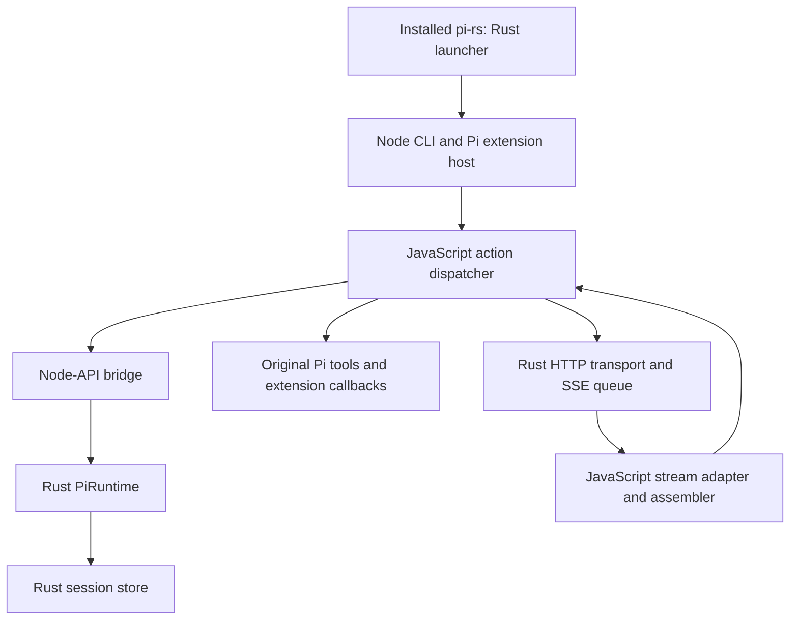

# Architecture and feature map

**Current integration boundary:** pi-rs runs its own headless CLI, not upstream Pi CLI with a swapped Agent. The existing drive module is not an Agent-compatible object. See [executed core replacement review](core-replacement-review.md) for the negative injection experiment and next acceptance. Historical sections below contain stale ownership details and must not be treated as current verification.

> Ownership update (2026-09-15): the target boundary is defined in [AGENTS.md](../AGENTS.md#runtime-ownership). Default user steer/follow-up selection (one-at-a-time/all at final response and completed sequential tool and parallel batch boundaries), drive action budget and nextTurn custom storage/admission live in Rust. Rust emits acknowledged agent_start/turn_start/turn_end/agent_end lifecycle actions and decides bounded Session continuation after agent_end; Node invokes unchanged callbacks before acknowledgement and reports provider exceptions; Rust constructs and persists the failure assistant and selects terminal lifecycle actions. Node forwards nextTurn sends immediately and exposes detached pending snapshots; deferred custom delivery still lives in Node. The original snapshot below dates from 2026-09-10, with this queue update applied; consult [checkpoint](checkpoint.md) and the board for later provider, prompt-resource and session-control slices.

Maintained snapshot: 2026-09-10. Source baseline: `87ccf68`, plus the pending installation verification and unused-accumulator cleanup. This document describes the implementation, not the intended finished product. Upstream reference: Pi `9767ba275f3e9a5ee0f5c5342249b629ab1b2282` ([reference details](upstream.md)).

## The core loop is small

Conceptually, a coding agent does this:

```text
append user input
repeat:
    derive model context from session history
    call model
    append assistant message
    if there are no tool calls: return
    execute requested tools and append their results
```

Recovery, cancellation, tool validation, provider protocols and extension callbacks complicate the boundaries. They should not require multiple competing implementations of this loop.

The current implementation is a hybrid: Rust decides the next action and persists results; JavaScript dispatches model/tool effects and runs unchanged Pi code. “Rust core” does not mean all control flow currently lives in Rust. Rust now owns the in-memory user steer/followUp queues, selection at a normal final-response boundary, and removal after successful admission. The JavaScript driver still contains the 32-action iteration limit, custom/nextTurn message handling and parts of error handling. This bounded migration does not complete the target ownership boundary.

## What actually runs



There is one Node host process after the Unix Rust launcher replaces itself with Node. The Rust addon executes in that process; provider streaming uses a Rust worker thread and bounded queue. This path is not a subprocess sidecar.

| Responsibility | Current source | Notes |
|---|---|---|
| Installed executable | `src/main.rs` | Launches Node with checkout-relative assets resolved from the compile-time source directory. |
| CLI configuration | `bin/pi-rs.mjs` → `bin/pi-native.mjs` | Parses input/session/model flags, loads dependencies, constructs host and runtime. |
| Action decisions | `src/pi_runtime.rs` | Receives begin/model/tool events; yields model, tool, tool_batch or done actions. |
| User scheduling | `src/pi_runtime.rs` (`enqueue_user`, `pending_users`, `advance_queued`) | Default one-at-a-time, FIFO per mode, steer before followUp, terminal failure/cancel retention; pending messages are in memory, consumed messages canonical. JS forwards requests and observes returned admissions. |
| Effect dispatch | `prototype/architecture/native-runtime-driver.mjs` | Runs model requests and original tools, invokes hooks, sends results back to Rust; capped at 32 dispatch iterations. |
| Node-API bridge | `prototype/native-session.rs`, `prototype/architecture/native-store-backend.mjs` | JSON request/response interface and native handles. Despite their directory names, these files are on the default CLI path. |
| Canonical session history | `src/pi_session_store.rs`, `src/pi_session_index.rs` | File-backed entries and branch context. JS supplies some entry metadata. |
| Model catalog | Vendored Pi `ModelRuntime`, `model-transport.mjs` | CLI currently accepts the built-in OpenAI path. |
| Network and SSE framing | `src/provider.rs`, `src/stream_queue.rs` | Rust HTTP requests, byte decoding and bounded event queue. |
| SSE message assembly | `native-stream-bridge.mjs`, `openai-stream-adapter.mjs`, `stream-assembler.mjs` under `prototype/architecture/` | Active path already assembles text and indexed tool-call fragments. |
| Pi tools/extensions | `prototype/real-plugin-host.mjs` and vendored Pi | Original loader, runner, tool implementations and validation remain in Node. |
| Installation | `scripts/install.sh` | Builds retained source assets and installs the launcher to a user bin directory. |

## One request, end to end

1. CLI opens or creates a session, resolves the model and loads explicitly supplied extensions plus original coding tools.
2. `drive()` sends `begin` to Rust. A model action contains the session entries for the selected context.
3. JS converts entries to Pi messages; Rust projects context; the extension `context` hook can transform the model view.
4. `nativeProviderStream()` starts Rust HTTP streaming. `assembleNativeQueue()` consumes the queue and assembles a canonical assistant response. The driver sends `model_result` back to Rust.
5. For a tool action, JS validates arguments and calls extension hooks, executes the original Pi tool, forwards updates, and submits `tool_result`. Rust persists the result and selects the next action.
6. At `done`, the dispatcher persists supported deferred extension messages and returns a JSON report. A later process opens the same session to continue.

This is already a model → tool → model path. Earlier claims that a new SSE aggregation bridge was required were incorrect. The subsequently added ID-keyed `ChatDeltaAccumulator` was unused and mishandled fragments without repeated IDs; its pending removal avoids integrating a competing, incompatible path.

## State and contracts

- **Canonical history** is durable session data. Context projection is a model view; it must not rewrite historical tool results.
- **Runtime action/result correlation** is carried through request IDs at the native boundary. Effects return results to Rust rather than independently deciding the next turn.
- **Extension compatibility** means preserving observable upstream behavior. Loading unchanged TypeScript is necessary but does not prove every callback or UI API works.
- **Tools run with host permissions.** The workspace argument is not a sandbox.
- **Credentials** are read from the environment; CLI also loads `.env` beside its source checkout. It does not currently discover an arbitrary target workspace's `.env`.
- **Recovery** has verified normal fresh-process continuation. Do not extrapolate that to arbitrary crashes or exactly-once tool effects; see [runtime limits](runtime-details.md).

## Current feature coverage

“Live evidence” below means recorded prior real-model runs, not a fresh live run for this document. Fixture means deterministic scripted responses with real implementation execution.

| Capability | Current status | Evidence or limitation |
|---|---|---|
| Installed `pi-rs` command | Verified local installation | `experiments/formal-cli.py --binary ~/.cargo/bin/pi-rs`; remote curl bootstrap remains unverified. |
| Headless model/tool loop | Live evidence + fixtures | Board E223, E248–E251; formal CLI acceptance. |
| Write/edit and fresh-process recovery | Verified fixtures; live evidence | External file assertions and canonical-prefix retention in `formal-cli.py`. |
| OpenAI HTTP and SSE | Implemented; live evidence | E254/E269, native HTTP fixtures and stream assembly tests. |
| Original Pi tools | Used by default CLI | Full parity of every tool option is not established. |
| TypeScript extension loading and selected hooks | Partial | Context/tool callbacks and protected-path rejection tested; not all extension APIs. |
| Custom provider registration | Partial | Host registry and request prototypes exist; formal CLI model resolution is separate and OpenAI-gated. Endpoint override is not full provider compatibility. |
| Context editing | Partial | Rust projection with retained canonical history; no general quality/performance benefit proven. |
| Branching and compaction | Partial | Native store/CLI operations and bounded experiments; not full interactive Pi workflows. |
| Steer/follow-up messages | Partial | JS turn-end ordering and deferred persistence; not real-time interruption. |
| OAuth, interactive TUI, multiplayer | Incomplete | Not available as a complete user workflow. |
| 70–80% Pi parity | Not measured | No validated capability denominator supports that percentage yet. |

## Where complexity accumulated

The repository contains the active runtime, a legacy runtime, experiments, compatibility adapters and historical design documents. This makes a small conceptual loop look much larger and has caused duplicate work.

- `src/bin/pi-rs-legacy.rs` and much of `src/lib.rs` serve the older snapshot runtime. Their tests do not automatically validate the formal CLI.
- Files under `prototype/` include both production-path modules and experiments. Moving them into clear runtime/host directories is sensible housekeeping, but requires import/build verification.
- Multiple stream aggregators have been added without tracing their callers. Follow the active path above before adding another implementation.
- Comments can overstate ownership: the “Rust-owned” turn-boundary message ordering in the driver is currently implemented in JavaScript.
- Source-bound installation, placeholder session metadata, the fixed system prompt (`native architecture experiment`) and the hard-coded dispatch limit remain product gaps visible in the active code.

## Direction and maintenance

Keep a single Rust action state machine with a narrow Node effect boundary. Prioritize correcting the active user path over creating new provider abstractions or orchestration systems. Suggested order based on current code: validate remote installation; replace placeholder session/prompt metadata; make runtime limits explicit; then connect extension-selected models/providers through the same execution path. Preserve existing working stream assembly while evaluating which responsibilities should move to Rust.

When changing architecture, update the relevant row and request-flow step here in the same change. Record commands, failures and verification scope in [the append-only board](board.jsonl); put the current handoff in [checkpoint](checkpoint.md). Historical decisions remain in their existing documents and must not override current code evidence. README is the public entry point; this document is the implementation map; runtime-details owns operational gotchas. Do not copy the full board into this file.
